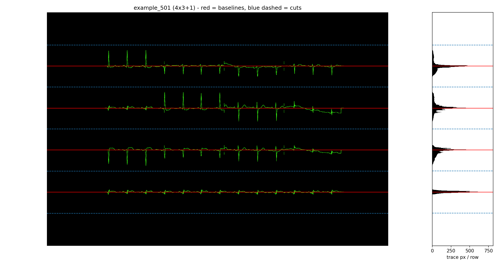

# U-Net ECG Segmentation

`mmecg` = Mask My ECG.

Goal: train a model (U-Net) that takes an ECG plot image and masks/segments the region(s) of the ECG trace — i.e. extract the waveform area from any ECG plot.

<p align="center">
  
</p>


U-Net architecture diagram, from the original paper: Olaf Ronneberger, Philipp Fischer, Thomas Brox. ["U-Net: Convolutional Networks for Biomedical Image Segmentation"](https://arxiv.org/abs/1505.04597) (2015).

## Structure

- `ptb-xl/` — PTB-XL dataset (metadata tracked; large waveform files `.h5`, `records100/`, `records500/` are gitignored, see [LICENSE.txt](ptb-xl/LICENSE.txt) for CC BY 4.0 attribution terms)
- `ecg-preprocessing/` — preprocessing package for generating ECG plot images/masks from PTB-XL records
- `digitize/` — digitization pipeline scripts

## How it works

**1. Input image.** `make_dataset.py` renders an ECG plot from PTB-XL signal data via `pmecg`, styled like real ECG paper (grid, no calibration pulse/labels — see below for why). This is what the model receives as input.


**2. Ground truth mask.** For the same signal, `make_dataset.py` also renders a bare version (no grid/decoration, trace only) and converts it to a binary neon-on-black mask — this is the label the model is trained to predict. Calibration pulse and lead labels are deliberately excluded from the *input* image too (not just the mask), because otherwise the model would be shown shapes it's never told to classify as background, and would learn false positives on them.

<p align="center">
  
</p>

**3. Training.** `unet-src/train.py` trains a U-Net (`unet-src/unet/`) on (image, mask) pairs from `unet-src/data/imgs`/`data/masks`, saving one checkpoint per epoch to `unet-src/checkpoints/` and per-epoch loss/Dice score to `unet-src/training_log.csv`. Below is the final (epoch 5) prediction on a held-out test image never seen during training:

<p align="center">
  
</p>

Loss and validation Dice per epoch for this run (`unet-src/training_log.csv`) — loss drops sharply after epoch 1, Dice is already at 0.93 by the first epoch and settles around 0.98-0.99:

<p align="center">
  
</p>

**4. Digitizing.** `analysis/splits/rows.py` finds each lead's baseline as a peak in the mask's row-density profile (the baseline is flat, so it concentrates ink in one image row, unlike the near-vertical QRS) and cuts the page midway between neighbouring baselines, writing one PNG per row plus a peaks CSV. The row pitch is measured from the image by autocorrelation, so nothing assumes the paper's dpi or margins:

<p align="center">
  
</p>

`digitize/digitize_pieces.py` then vectorizes those pieces into millivolts, `digitize/replot_digitized.py` renders the result back onto ECG paper, and `digitize/compare_to_truth.py` scores it against the h5 signal the page was generated from — closing the loop image -> mask -> rows -> signal -> paper.

**5. Comparing against truth.** `analysis/comparisons/compare_overlay.py` overlays the raw predicted mask directly against the truth image (blue = truth only, red = predicted only, purple = both agree) — this is more reliable than comparing against the replot, since `pmecg`'s renderer has a data-dependent rendering drift on dense signals (documented in `replot_prediction.py`) that the raw mask isn't subject to:

<p align="center">
  
</p>

## Where things are

- `make_dataset.py` — generates (image, mask) training pairs from `ptb-xl/ptb_preprocessed.h5` into `unet-src/data/imgs`/`masks` (records 0-499) and a held-out set into `test_imgs`/`test_masks` (records 500-549), with a random layout template per record logged to `dataset_index.csv`/`test_index.csv`
- `unet-src/train.py` — trains the model, saves checkpoints to `unet-src/checkpoints/` and a per-epoch log to `unet-src/training_log.csv`
- `unet-src/predict.py` — runs a trained checkpoint on an input image, saves the predicted mask
- `layout_keys.csv` — the shared layout contract (class index, template, rows, boundaries), read by `data_loading.py`, `rows.py` and the analysis scripts
- `analysis/splits/rows.py` — finds lead baselines and cuts a predicted mask into per-row pieces; writes `Predictions/pieces/*_rowNN.png` and `analysis/splits/*_peaks.csv`
- `digitize/digitize_pieces.py` — vectorizes the row pieces into mV signals, into `Predictions/final/`
- `digitize/replot_digitized.py` — renders a digitized CSV back onto ECG paper via `pmecg`
- `digitize/compare_to_truth.py` — scores a digitized CSV against the source h5 signal, into `Predictions/digitized_vs_truth/`
- `analysis/comparisons/compare_overlay.py` — overlays a predicted mask against truth (agree/disagree diff)
- `analysis/metrics/` — training curves, per-record test metrics, confusion matrix

## Setup

```
pip install -r ecg-preprocessing/requirements.txt
```

## Data source

PTB-XL dataset via PhysioNet, licensed CC BY 4.0 — attribution required if shared/published.

## Credits

- U-Net implementation vendored from [milesial/Pytorch-UNet](https://github.com/milesial/Pytorch-UNet)
- ECG plot rendering via [bonassifabio/pmecg](https://github.com/bonassifabio/pmecg)
