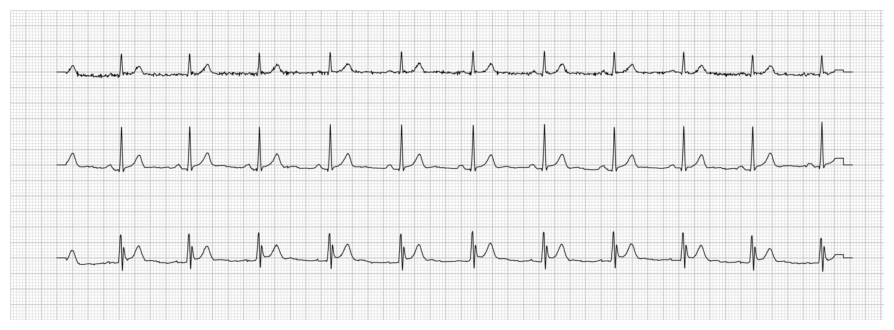
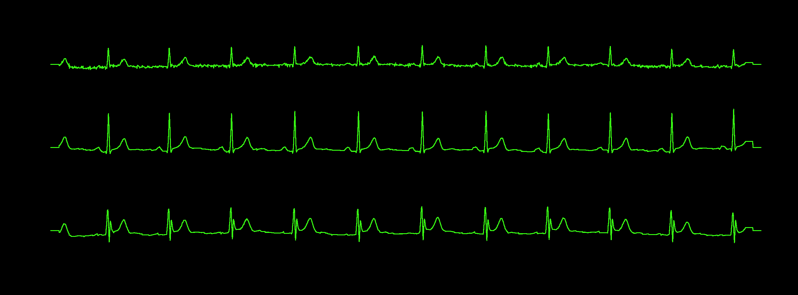
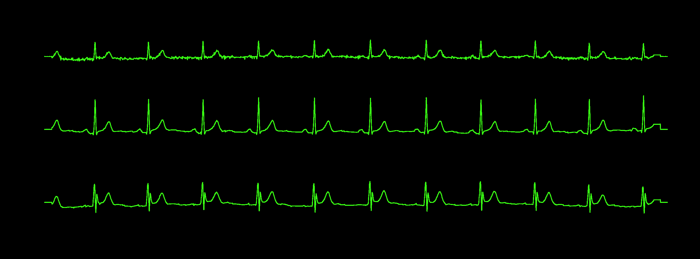
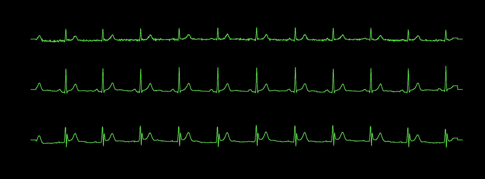
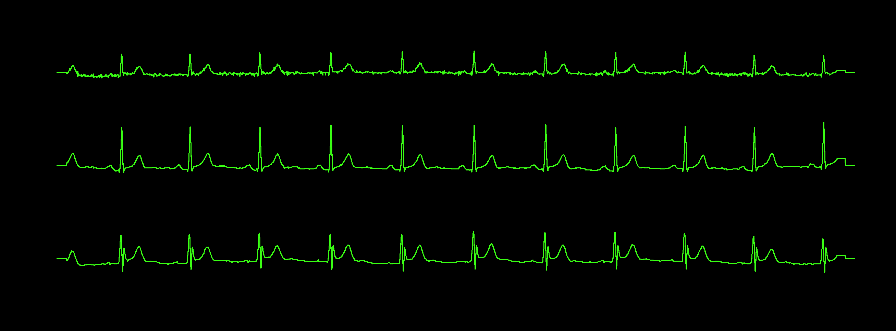
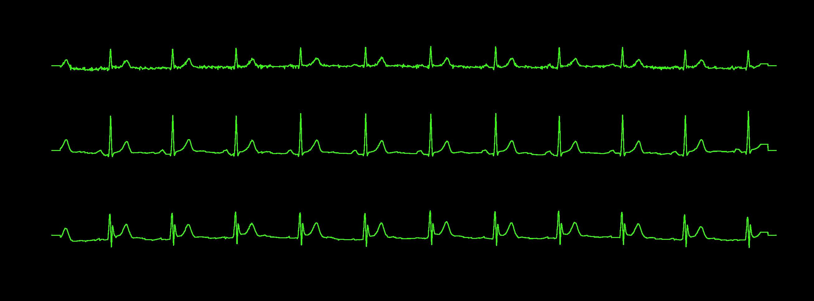
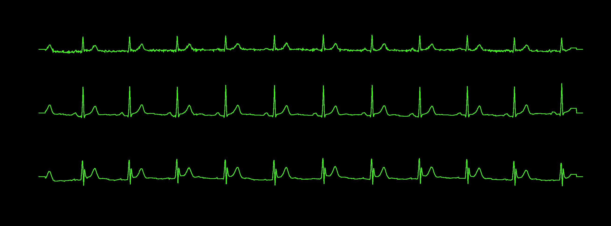
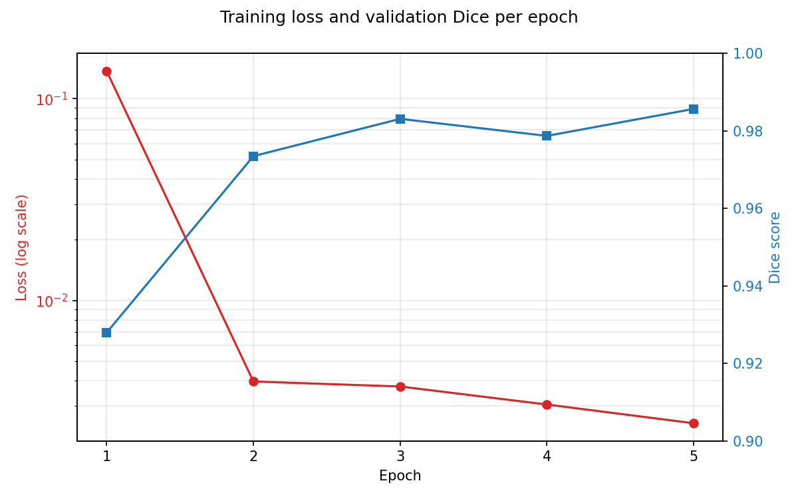
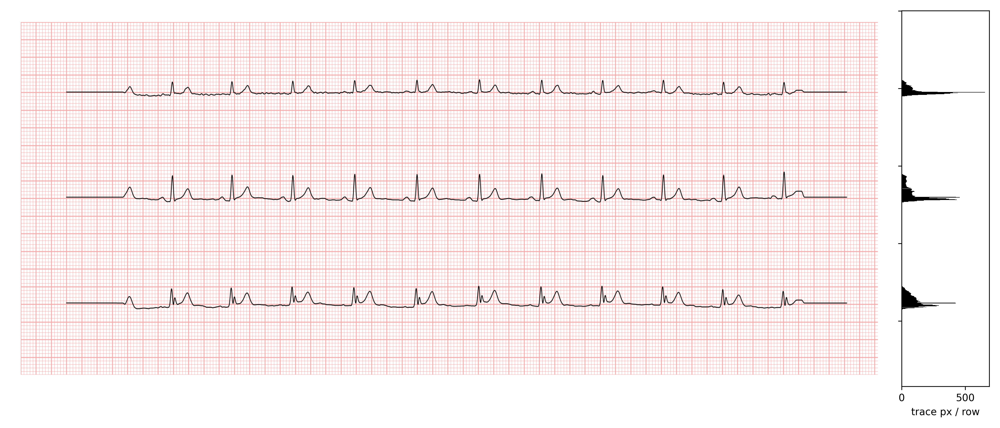
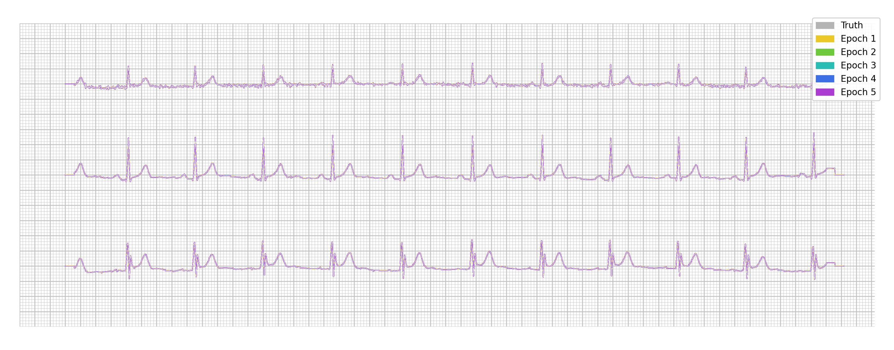

# U-Net ECG Segmentation

`mmecg` = Mask My ECG.

Goal: train a model (U-Net) that takes an ECG plot image and masks/segments the region(s) of the ECG trace — i.e. extract the waveform area from any ECG plot.

## Structure

- `ptb-xl/` — PTB-XL dataset (metadata tracked; large waveform files `.h5`, `records100/`, `records500/` are gitignored, see [LICENSE.txt](ptb-xl/LICENSE.txt) for CC BY 4.0 attribution terms)
- `ecg-preprocessing/` — preprocessing package for generating ECG plot images/masks from PTB-XL records
- `pmecg/` — scratch scripts

## How it works

**1. Input image.** `make_mask.py` renders an ECG plot from PTB-XL signal data via `pmecg`, styled like real ECG paper (grid, no calibration pulse/labels — see below for why). This is what the model receives as input.



**2. Ground truth mask.** For the same signal, `make_mask.py` also renders a bare version (no grid/decoration, trace only) and converts it to a binary neon-on-black mask — this is the label the model is trained to predict. Calibration pulse and lead labels are deliberately excluded from the *input* image too (not just the mask), because otherwise the model would be shown shapes it's never told to classify as background, and would learn false positives on them.



**3. Training.** `unet-src/train.py` trains a U-Net (`unet-src/unet/`) on (image, mask) pairs from `unet-src/data/imgs`/`data/masks`, saving one checkpoint per epoch to `unet-src/checkpoints/` and per-epoch loss/Dice score to `unet-src/training_log.csv`. Below is the same held-out test image (never seen during training) predicted by the model at increasing epochs — epoch 1 barely finds anything, and it converges close to the ground truth by epoch 4:

| Epoch 1 | Epoch 2 | Epoch 3 | Epoch 4 | Epoch 5 |
|---|---|---|---|---|
|  |  |  |  |  |

The final (epoch 5) prediction, standalone:



Loss and validation Dice per epoch for this run (`unet-src/training_log.csv`) — loss drops sharply after epoch 1, Dice is already at 0.93 by the first epoch and settles around 0.98-0.99:



**4. Replotting + density check.** `pmecg/replot_prediction.py` takes a predicted mask, extracts a rough signal back out of it (per-column trace centroid, gaps left as gaps — no interpolation across what the model didn't predict), and re-renders it through `pmecg` in the same styled format as the original input. It also plots a row-density histogram alongside the image: for each row, how many trace pixels the prediction has. This produces 3 distinct peaks (one per lead) separated by valleys, which is what future work will use to automatically split a 3-lead plot into 3 separate per-lead images.



**5. Comparing against truth.** `comparisons/compare_overlay.py` overlays the raw predicted mask directly against the truth image (blue = truth only, red = predicted only, purple = both agree) — this is more reliable than comparing against the replot, since `pmecg`'s renderer has a data-dependent rendering drift on dense signals (documented in `replot_prediction.py`) that the raw mask isn't subject to:


`comparisons/compare_epochs.py` shows the same idea across all 5 epochs at once (yellow → green → teal → blue → purple), so you can see exactly which parts of the trace converge fastest — mostly the sharp QRS spikes, which take the longest to nail down:



## Where things are

- `make_mask.py` — generates (image, mask) training pairs from `ptb-xl/ptb_preprocessed.h5` into `unet-src/data/imgs`/`data/masks` (and a held-out set into `data/test_imgs`/`data/test_masks`)
- `unet-src/train.py` — trains the model, saves checkpoints to `unet-src/checkpoints/` and a per-epoch log to `unet-src/training_log.csv`
- `unet-src/predict.py` — runs a trained checkpoint on an input image, saves the predicted mask
- `pmecg/replot_prediction.py` — takes a predicted mask, reconstructs a signal, replots it via `pmecg`, and adds the row-density histogram; reads from `Predictions/raw/`, outputs to `Predictions/replotted/`
- `comparisons/compare_overlay.py` — overlays a raw predicted mask against truth (agree/disagree diff), outputs to `comparisons/`
- `comparisons/compare_epochs.py` — overlays all 5 epochs' disagreement with truth in one image, outputs to `comparisons/`

## Setup

```
pip install -r ecg-preprocessing/requirements.txt
```

## Data source

PTB-XL dataset via PhysioNet, licensed CC BY 4.0 — attribution required if shared/published.
